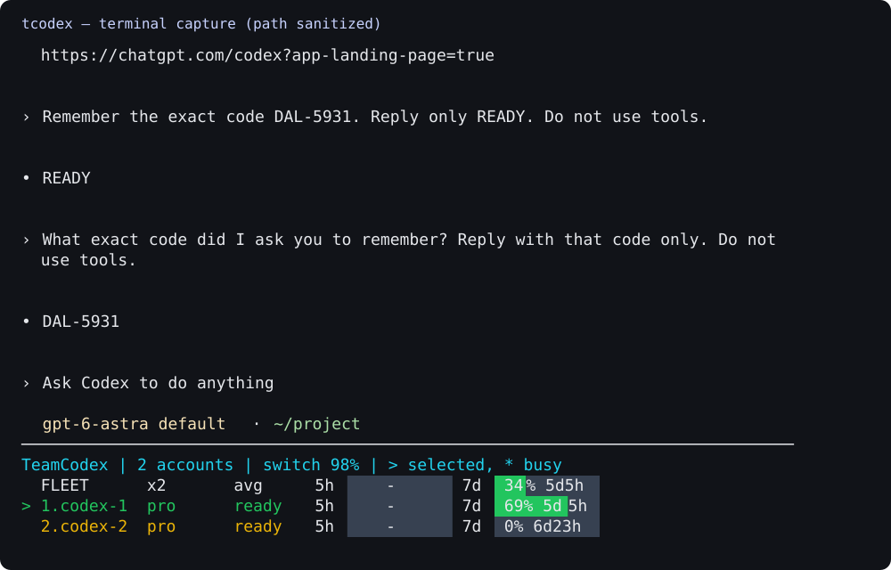

# tcodex

Codex CLI를 실행하면서 하단에 여러 계정의 사용률과 선택 상태를 보여주는 터미널 실행기입니다.
계정 전환은 외부 TeamCodex 프록시가 담당합니다.



실제 터미널 캡처를 SVG로 옮긴 미리보기입니다. 작업 경로는 `~/project`로 치환했습니다.

[teamclaude-statusline](https://github.com/cineraria01/teamclaude-statusline)의 표시 방식을
[TeamCodex](https://github.com/sangrokjung/teamclaude)용으로 옮긴 읽기 전용 상태줄입니다.

```text
TeamCodex | 2 accounts | switch 98% | > selected, * busy
  FLEET      x2       avg   5h [    -     ] 7d [ 34% 5d5h ]
> 1.codex-1  pro      ready 5h [    -     ] 7d [ 69% 5d5h ]
  2.codex-2  pro      ready 5h [    -     ] 7d [ 0% 6d23h ]
```

예시는 사용률이며 잔여량이 아닙니다. 시간은 쿼터 초기화까지 남은 시간입니다.
컬러 터미널에서는 사용률에 따라 막대가 초록·노랑·빨강으로 채워집니다.

## 사용

macOS에서 검증했습니다. Python 3.9 이상, 공식 Codex CLI, 실행 중인 TeamCodex가 필요합니다.
TeamCodex를 처음 설치한다면 [프록시 설치 및 계정 등록](docs/SETUP.md)을 먼저 진행하세요. 하단 고정 실행에는 tmux도 필요합니다.

```sh
brew install tmux                 # macOS, 최초 한 번
git clone https://github.com/cineraria01/tcodex.git
cd tcodex
python3 install.py
teamcodex-statusline              # 현재 상태 한 번 표시
teamcodex-statusline --watch      # 별도 터미널에서 2초마다 갱신
tcodex                           # Codex와 계정 상태줄을 같은 화면에 표시
tcodex resume SESSION_ID          # 지정한 기존 대화 재개
```

`~/.local/bin`이 PATH에 있어야 합니다. `tcodex`는 현재 폴더에서 `teamcodex run`을
실행합니다. 실제 Codex 화면 아래에 tmux 패널을 배치하며, 기존 Codex·Claude 설정 파일을
수정하지 않습니다. `Ctrl-b d`로 연결만 끊은 뒤 다음 명령으로 다시 연결할 수 있습니다.

```sh
tmux -L teamcodex-hud attach
```

Codex 인수는 그대로 전달됩니다. 예: `tcodex -m MODEL`,
`tcodex --dangerously-bypass-approvals-and-sandbox`. 마지막 옵션은 승인 확인과 샌드박스를
해제합니다. 실행기가 기본으로 추가하지 않으며, 생략 시 기존 Codex 설정을 따릅니다.

Codex를 종료하면 해당 tmux 세션도 종료됩니다. 기존 일반 tmux 세션은 별도 소켓으로
분리됩니다. 70열 이상, 계정 수 + 12행 이상인 터미널을 사용하세요.

## 표시 의미

- `>`: 프록시가 선택한 계정. 해당 Codex 대화에 고정된 계정이라는 뜻은 아닙니다.
- `*` / `busy`: 현재 요청 처리 중. 여러 대화가 동시에 사용하면 여러 계정이 표시될 수 있습니다.
- `ready`, `off`, `wait`, `limit`, `error`: 사용 가능, 제외, 제한 대기, 쿼터/용량 제한, 인증 등 오류.
- `5h`, `7d`: 프록시가 보고하는 세션·주간 사용률과 리셋 시간. 미보고 값은 `-`입니다.
- `FLEET avg`: 활성화되고 오류가 없는 계정 중 측정된 값의 단순 평균. 요금제별 용량 가중 합계가 아닙니다.
- 주간 리셋 순으로 표시하되 원래 계정 번호는 유지합니다. 상태줄은 실제 라우팅 순서를 변경하지 않습니다.

Codex가 제공하지 않는 Fable 쿼터나 결제일은 표시하지 않습니다. 값은 TeamCodex의
관측 주기에 따르며, 화면의 2초 갱신이 OpenAI 쿼터를 새로 조회한다는 뜻은 아닙니다.
응답 오류 시 오래된 값을 현재 상태처럼 표시하지 않습니다.

## 연결 범위

Codex CLI의 기본 `tui.status_line`은 내장 항목만 지원합니다. 이 프로젝트는 공식 CLI를
수정하지 않고 하단 패널로 표시합니다. Orca의 그래픽 채팅 화면에 직접 삽입하는 기능은
없으며, Orca 안의 터미널에서는 `tcodex`로 사용할 수 있습니다.

`~/.config/teamcodex.json`의 로컬 프록시 포트와 프록시 인증키를 읽고
`/teamclaude/status`만 조회합니다. OAuth 토큰은 전송하지 않으며 별도 캐시도 저장하지
않습니다. 환경 HTTP 프록시와 HTTP 리다이렉트를 사용하지 않습니다.

## 검증 / 제거

두 계정 사이에서 같은 CLI 프로세스의 대화가 유지되는 것을 수동 계정 제외로 확인했습니다.
실제 한도를 소진한 시험은 아니며, 429 자동 전환은 검증한 upstream의 모의 서버 테스트 범위입니다.
계정 전환 후 모든 도구 호출의 중복 실행 방지까지 보장하는 것은 아닙니다.
아래 검사는 계정 로그인이나 모델 호출 없이 렌더링, 로컬 HTTP 인증, 리다이렉트 거부,
설치 재실행 및 기존 명령 보존을 확인합니다.

```sh
python3 test_statusline.py
```

설치 위치는 `~/.local/share/teamcodex-statusline`이며 글로벌 명령 두 개는 이 위치로
연결된 심볼릭 링크입니다. 제거 시 이 폴더와 자신이 설치한
`~/.local/bin/tcodex`, `~/.local/bin/teamcodex-statusline` 링크만 제거하면 됩니다.
TeamCodex 서버와 계정 설정은 별개입니다. 설치 테스트는 `TEAMCODEX_HUD_PREFIX`로
별도 경로를 지정할 수 있습니다.

MIT. 막대 표시 방식과 FLEET 설계는 cineraria01/teamclaude-statusline에서 가져왔습니다.
